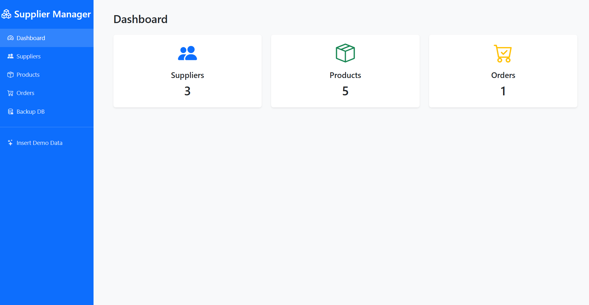
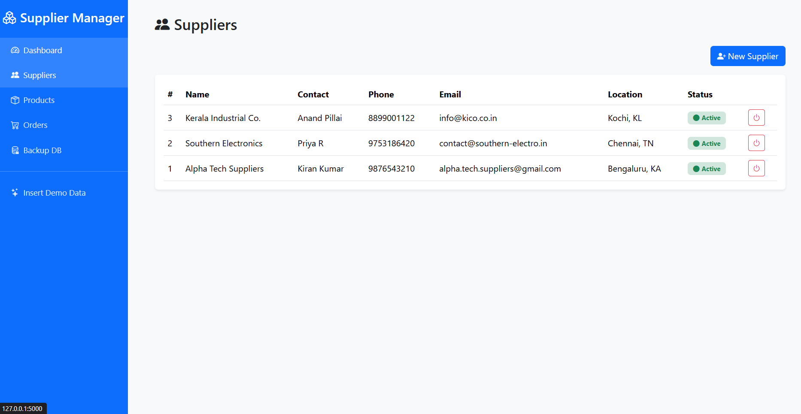
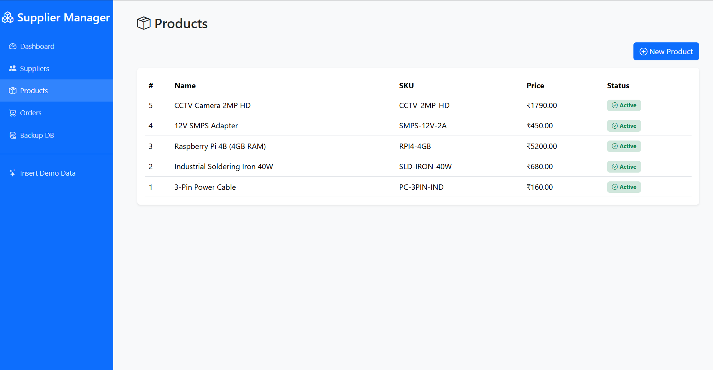
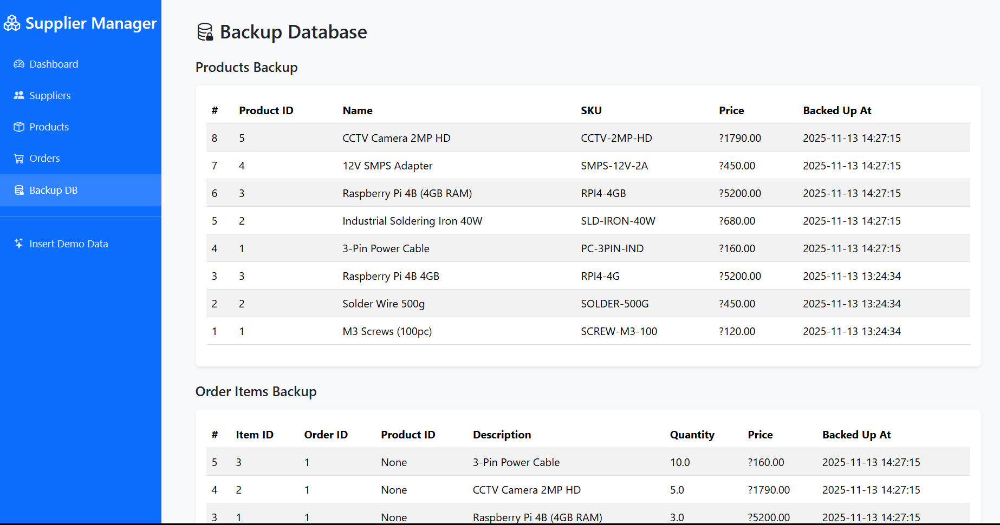
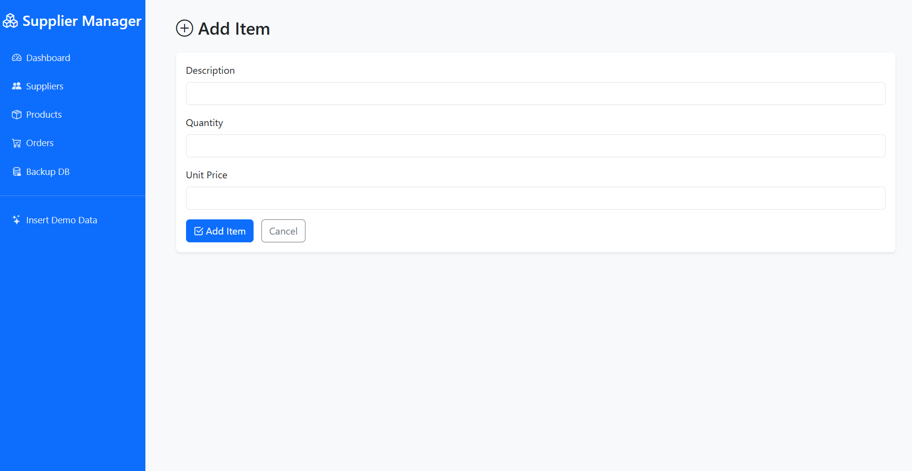

# 📦 Supplier Management System

A Flask-based inventory & procurement management application with automated database backup using SQLite triggers.

---

## 📘 Overview

The **Supplier Management System** is a mini full-stack web application built using **Flask**, **SQLite**, **Bootstrap 5**, and **Jinja2 templates**.  
It helps organizations maintain suppliers, products, purchase orders, and automatically maintain a **separate backup database** through SQL triggers and Python replication logic.

Ideal for **MCA mini-projects**, **DBMS coursework**, or a **portfolio project**.

---

## 🚀 Features

### **1. Supplier Management**
- Add suppliers  
- View supplier list  
- Soft deactivate suppliers  
- Track contact details, phone, city, state, email  

### **2. Product Management**
- Add new products  
- Auto-audit each product insertion using triggers  
- Track SKU, unit price, activity status  

### **3. Purchase Orders**
- Create purchase orders  
- Add multiple items  
- Auto-calculate totals  
- View full order summary  

### **4. Automatic Backup Database**

This project maintains **two SQLite databases**:

| Purpose | File |
|--------|------|
| Main operational DB | `supplier_mgmt.db` |
| Permanent backup DB | `supplier_backup.db` |

**Backup Workflow:**
1. Triggers insert audit rows into `products_audit` and `order_items_audit`  
2. Python detects un-synced audit rows  
3. Audit rows are replicated into the backup DB  
4. Even if the main DB item is deleted → backup remains safe  

This satisfies academic requirements for:
- SQL **Triggers**
- **Backup systems**
- **Audit tables**
- **DB consistency**

---

### **5. Dashboard**
A clean dashboard showing:
- Total suppliers  
- Total products  
- Total orders  

---

### **6. Demo Data Seeder**

One-click:/seed_demo


Populates:
- 2 suppliers  
- 3 products  
- 1 purchase order  
- 2 order items  
- Full backup replication  

Perfect for **viva** and **presentations**.

---

## 🗂️ Project Structure
SupplierManagement/
│
├── app.py
├── supplier_mgmt.db
├── supplier_backup.db
│
├── static/
│ └── images/
│
└── templates/
├── base.html
├── dashboard.html
├── suppliers.html
├── add_supplier.html
├── products.html
├── add_product.html
├── orders.html
├── add_order.html
├── add_item.html
├── order_detail.html
└── backup.html


---

## 🛠️ Installation & Setup

### **1. Clone the Repository**
```bash
git clone https://github.com/DrRival/SupplierManagementSystem.git
cd SupplierManagementSystem

2. Create Virtual Environment
python -m venv venv


Activate:

Windows:

venv\Scripts\activate

3. Install Requirements
pip install flask


SQLite comes pre-installed with Python.

4. Run the Application
python app.py


Visit in browser:

http://127.0.0.1:5000

🛢️ Database Architecture
Main Tables

suppliers

products

purchase_orders

purchase_order_items

Audit Tables

products_audit

order_items_audit

Backup DB Tables

products_backup

order_items_backup

Triggers Used
CREATE TRIGGER trg_products_audit
AFTER INSERT ON products
BEGIN
    INSERT INTO products_audit(product_id, name, sku, unit_price)
    VALUES (NEW.product_id, NEW.name, NEW.sku, NEW.unit_price);
END;

CREATE TRIGGER trg_order_items_audit
AFTER INSERT ON purchase_order_items
BEGIN
    INSERT INTO order_items_audit(item_id, order_id, product_id, description, quantity, unit_price)
    VALUES (NEW.item_id, NEW.order_id, NEW.product_id, NEW.description, NEW.quantity, NEW.unit_price);
END;

🖼️ Screenshots

Place images in:
static/images/







📚 How Backup Works (Viva Explanation)

You add a product → trigger fires

Trigger inserts a row into products_audit

Python checks for new audit rows

New rows are replicated to backup DB

Even if main DB product is deleted → backup remains

This demonstrates:

Trigger correctness

Backup system stability

Data replication mechanism

Data integrity maintenance

🧪 Demo Data Included

When visiting:

http://127.0.0.1:5000/seed_demo


The app creates:

Suppliers

Acme Industrial

TechParts Co.

Products

M3 Screws

Solder Wire

Raspberry Pi 4B

Orders

1 order with 2 items

Backup DB is updated automatically.

📄 License

MIT License
